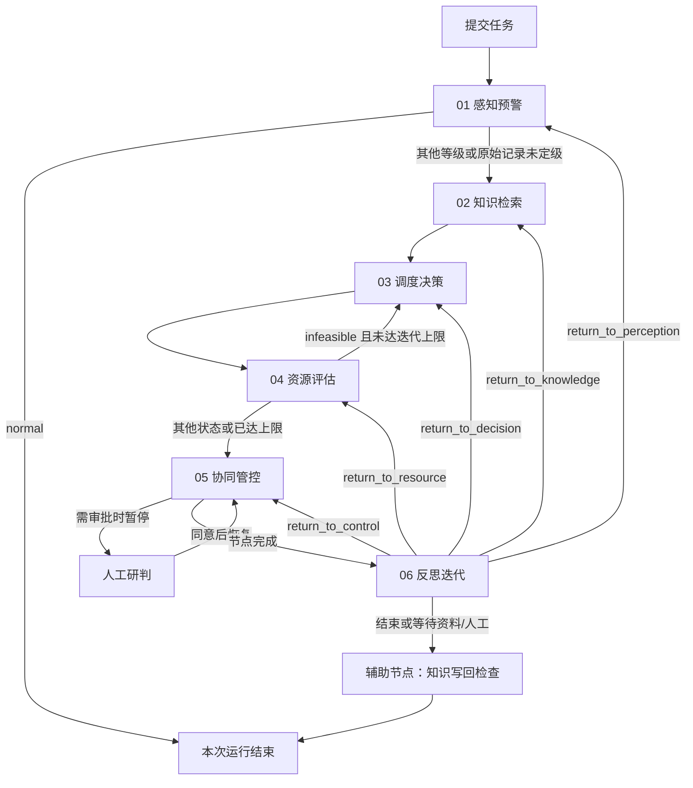

# MineGuard Agents

**矿安智联 · 煤矿顶板灾变监测、预警、决策与协同处置六智能体平台**

MineGuard Agents 将监测数据校验、风险初评、知识检索、处置建议、资源核算、人工研判和后续观测复核组织成一个可追踪的工作流。用户从浏览器提交监测摘要或逐条微震记录，观察各节点实际执行状态，并查看结构化结果及其依据。

项目的主要交付是**监测研判与辅助决策软件**。它输出本次输入的统计或初评、相关资料、建议动作、资源数量对比和下一步核验事项。软件流程完成、资源数量满足、现场方案获准执行是不同的结果，本文分别解释。

本文以仓库当前提交为准。“当前行为”指已实现的数据流；可选服务只有在完成对应配置后才会参与运行。

## 阅读导航

- [1. 项目背景与目标](#1-项目背景与目标)
- [2. 功能与运行模式](#2-功能与运行模式)
- [3. 技术栈](#3-技术栈)
- [4. 六 Agent 职责和流程](#4-六-agent-职责和流程)
- [5. 架构与数据流](#5-架构与数据流)
- [6. 源码目录](#6-源码目录)
- [7. 安装与启动](#7-安装与启动)
- [8. 第一次前端运行](#8-第一次前端运行)
- [9. 输入格式与完整示例](#9-输入格式与完整示例)
- [10. 资料配置与实际接入](#10-资料配置与实际接入)
- [11. 如何理解结果](#11-如何理解结果)
- [12. 人工研判与后续观测](#12-人工研判与后续观测)
- [13. 模型和外部系统接入](#13-模型和外部系统接入)
- [14. API 与实时事件](#14-api-与实时事件)
- [15. 测试与验收](#15-测试与验收)
- [16. 常见问题排查](#16-常见问题排查)
- [17. 部署、备份与源码发布](#17-部署备份与源码发布)
- [18. 扩展开发与文档索引](#18-扩展开发与文档索引)

## 1. 项目背景与目标

煤矿顶板灾变研判涉及微震能量、事件频次、b 值、监测质量、地质和支护条件、历史案例、人员设备与执行反馈。单独展示一组异常指标，不能回答“依据是什么、下一步做什么、资源是否满足、谁来确认、措施实施后发生了什么”。

本项目把这些问题拆成六个有明确输入输出的 Agent 节点，由状态机组织执行：

| 业务问题 | 系统提供的信息 |
| --- | --- |
| 监测记录反映了什么？ | 输入校验、原始统计或规则初评、异常项和数据来源 |
| 可以参考什么资料？ | 事故资料、法规摘录、匹配依据及来源 |
| 建议下一步做什么？ | 动作顺序、责任岗位、复查和核验建议、审批需求 |
| 给定资源够不够？ | 用户需求与可用量对比、数量缺口、库存来源 |
| 如何衔接人工和业务系统？ | 研判意见、身份核验、显式通知及回执接口 |
| 后续情况是否变化？ | 关联原任务的复核记录、可比较指标与待核验事项 |

适用场景包括项目展示、软件流程验证、监测数据处理实验、公开历史数据回放及知识与业务系统接入开发。用于具体矿井时，需要进一步确认方法适用范围、数据质量、专业方案、权限和执行流程。

## 2. 功能与运行模式

### 2.1 三种输入模式

| 模式 | 前端入口 | 实际处理 | 典型输出 |
| --- | --- | --- | --- |
| 预设场景 | 七个场景卡片 | 按场景 ID 加载 fixture 并执行工作流；部分决策和反思包含场景化模拟逻辑 | 分级、审批、资源回退和迭代上限的流程展示 |
| 自定义监测摘要 | 底部对话输入框 | 解析中文摘要或摘要 JSON，读取适用矿井配置；未配规则时仅统计 | 风险初评、异常项、资料、复查建议和资源数量核算 |
| 原始监测记录 | “原始监测记录”展开框 | 校验 JSON/CSV，读取同一套矿井配置和资料，统计、分级或显式研究报警 | 实际事件数、能量、频次、方法适用性及核验建议 |

点击卡片会执行代码，但 fixture 内容及部分业务结果本身是为演示设计的。不能把演示场景当成对用户实测资料的独立验证。

自定义任务进入 `scenario_id="custom"` 分支，输入不必与七张卡片相同；校验失败不会自动套用预设答案。

### 2.2 “完整运行”与“现场可用”的区别

所有实际数据任务均执行六个节点，产生统计、知识、建议、资源与复核状态。仅演示场景的 normal 分支在感知节点结束。实际数据的资源缺口不会通过重复计算同一个固定方案消失：保留缺口，调整资料后重新运行。

以下结论分别需要对应证据：

- **计算完成**：程序按所选方法处理了合法输入。
- **所列资源数量满足**：清单中的可用量满足用户填写的需求量。
- **现场执行条件成立**：还要核验完整方案需求、人员资质、设备状态、库存时效和现场条件。
- **处置有效**：还要有可信执行记录、后续观测、可比统计口径和现场评价。

“上传了所有文件”不自动等于后三项成立。第 10 节列出当前上传内容是否真正进入计算。

## 3. 技术栈

| 层次 | 技术 | 项目用途 |
| --- | --- | --- |
| 前端 | React 19、TypeScript | 场景、对话、状态、配置与反馈交互 |
| 前端构建 | Vite 7 | 开发服务器、热更新、静态资源构建 |
| UI | Ant Design 5、Ant Design Icons、Tailwind CSS 4、自定义 CSS | 表单、提示、布局与滚动面板 |
| Markdown | react-markdown、remark-gfm | 文本结果与表格渲染 |
| API | FastAPI、Uvicorn | HTTP、文件上传下载和 WebSocket |
| 数据契约 | Pydantic 2 | 任务、六 Agent 结果和工具参数校验 |
| 工作流 | LangGraph StateGraph | 条件路由、共享状态、检查点、人工中断与恢复 |
| 模型与工具 | LangChain、OpenAI 兼容接口 | 可选节点推理、工具调用、结构化提取 |
| MCP | Python MCP SDK、langchain-mcp-adapters | 工具协议桥接与白名单 |
| 检查点与锁 | Redis Stack、langgraph-checkpoint-redis | 图状态持久化、分布式锁 |
| 业务归档 | SQLite | 自定义结果、反馈、业务请求和回执 |
| 计算 | Python、NumPy、pandas | 规则评分、事件统计和历史回放 |
| 本地知识 | YAML、可追溯文档 | fixture、事故摘要、法规摘录 |
| 可选知识服务 | RAGFlow、Neo4j、Ollama 向量模型 | 文档检索、知识图谱和向量匹配 |
| 可选业务数据 | MySQL、HTTP 业务适配器 | 库存、身份、通知、工单与回执 |
| 基础设施 | Docker Compose | Redis 及可选数据库部署 |

六 Agent 主入口由 LangGraph StateGraph 直接驱动。前端通过 `POST /api/workflow/start` 创建任务，并通过 WebSocket 接收节点事件；项目运行不依赖其他智能体框架。

六个节点不等于每次调用六次大模型。自定义摘要和原始记录使用专门的确定性计算与证据处理分支；可选 LLM 增强主要用于其他节点路径。执行较快不能单独说明结果是预制答案，应检查实际输入、方法、轨迹和证据。

## 4. 六 Agent 职责和流程

### 4.1 节点分工

| Agent | 主要输入 | 处理 | 输出 |
| --- | --- | --- | --- |
| 01 感知预警 | 摘要或事件、方法版本 | 校验和统计、摘要评分、方法适用性检查 | 初评或指标、异常、因子、数据质量和方法依据 |
| 02 知识检索 | 异常及领域关键词 | 按路径读取可追溯文档、fixture 或配置的知识能力 | 案例、法规、来源与适用性说明 |
| 03 调度决策 | 感知与知识结果 | 形成复查、核验或场景处置建议 | 动作、岗位、时限、约束和审批标志 |
| 04 资源评估 | 资源快照或显式库存来源 | 逐项比较可用量和需求量 | 数量结果、缺口、来源和执行条件状态 |
| 05 协同管控 | 建议、资源和审批意见 | 人工中断与恢复、权限相关检查、协同记录 | 管控与研判状态，外部发送另走业务接口 |
| 06 反思迭代 | 前序结果、后续观测和执行报告 | 比较关联观测、确定等待或回退 | 复核结论、返回决策和人工复核需求 |

### 4.2 条件路由

下图对应 `agent/workflow.py`。知识写回是结束前的辅助节点，不是第七个业务 Agent。



回退受状态和迭代上限控制。不同模式会产生不同返回决策；没有后续观测的自定义任务通常记录 `wait_for_data`，不会凭空推导风险下降。

审批拒绝和取消由运行管理器处理，不属于图中的“同意后恢复”。资源回退达到上限后进入协同管控，也不表示资源问题已解决。

## 5. 架构与数据流

### 5.1 一次任务的生命周期

1. React 收集输入。文件先上传到会话目录，再显式读取并校验。
2. `POST /api/workflow/start` 检查场景或自定义任务，创建唯一 run ID。
3. 运行管理器组织 LangGraph 执行，绑定 thread ID、矿井和工作流上下文。
4. 节点发送开始与完成事件，产生符合 Pydantic 契约的阶段结果。
5. 监控管理器通过 `/ws/{thread_id}` 推送进度，前端更新轨迹。
6. 前端查询状态与完整结果；生成文件通过文件接口列出和下载。
7. 需要人工研判时暂停；记录意见后继续，或拒绝、取消。
8. 后续观测登记为关联原任务的反馈，启动新的复核运行，原结果保留。

### 5.2 标识与持久化

| 对象 | 用途 | 位置或机制 |
| --- | --- | --- |
| thread_id | 会话、文件隔离、WebSocket 通道 | API 上下文和前端会话 |
| run_id / workflow_run_id | 一次运行、审批、结果与轨迹 | 运行管理器和检查点 |
| LangGraph 检查点 | 图状态、中断和恢复 | 本文使用 Redis Stack |
| 自定义终态结果和反馈 | 快照及父子运行关系 | `output/workflow_archive.sqlite3` |
| 业务请求与回执 | 幂等提交和外部状态 | `output/business_ledger.sqlite3` |
| 上传文件 | 当前会话附件 | `updated/session_<thread_id>/` |
| 生成文件 | 会话输出 | `output/session_<thread_id>/` |
| 矿井配置与解析资料 | 测区隔离、不可变版本、原件和 SHA256、使用记录 | `output/mine_configuration.sqlite3` |
| 现场方案审批 | 独立实名核验记录，不覆盖初始结果 | 运行归档中的 `field_approvals` 表 |

Redis 检查点与 SQLite 归档用途不同。终态可查询不等于运行中任务能在重启后无条件自动继续。当前推荐单个 Uvicorn 工作进程；Redis 的存在不代表多实例业务账本和跨实例派工已经验收。

矿井配置保存在后端；换浏览器后输入相同矿井、巷道和测区，点击“读取本测区配置与资料”即可恢复。旧版浏览器 localStorage 配置不再参与计算，需通过新入口上传、校验并保存。

## 6. 源码目录

以下路径相对于包含本 README 的目录。若下载上层工作区，先进入 `agent1/`；若独立发布为 mineguard-agents，直接进入仓库根目录。

```text
mineguard-agents/
├── README.md
├── requirements-runtime.txt     # 主工作流直接依赖版本快照
├── .env.example                 # 后端配置模板
├── .gitignore
├── app/                         # app.xxx 导入兼容层
├── agent/
│   ├── workflow.py              # 图结构与条件路由
│   ├── workflow_nodes.py        # 六节点与审批、资源逻辑
│   ├── workflow_state.py        # 工作流共享状态
│   ├── custom_assessment.py     # 摘要证据与建议
│   ├── raw_assessment.py        # 原始记录感知与建议
│   ├── knowledge_sources.py     # 知识来源适配
│   ├── agent_subgraph.py        # 可选 LLM 子图
│   ├── checkpoint.py            # 检查点配置
│   └── subagents/               # Agent 定义与工具范围
├── api/
│   ├── server.py                # FastAPI 主入口
│   ├── workflow_runner.py       # 运行生命周期和事件
│   ├── monitoring_routes.py     # 原始记录与反馈接口
│   └── business_routes.py       # 身份、库存、通知和回执
├── schemas/                     # 任务、结果、MCP 与模型契约
├── services/                    # 规则、统计、文件、知识和业务服务
├── config/                      # 演示阈值及研究参数
├── prompt/prompts.yml           # 集中式提示词
├── tools/                       # 结构化工具
├── mcp_server/                  # MCP 服务与桥接
├── utils/                       # 锁、路径及文档辅助
├── frontend/
│   ├── src/components/          # 界面组件
│   ├── src/hooks/               # 会话与 WebSocket 生命周期
│   ├── src/lib/                 # API 客户端和连接配置
│   ├── package.json
│   ├── package-lock.json
│   └── vite.config.ts
├── deploy/                      # Redis/MySQL/Neo4j/RAGFlow 配套
├── tests/                       # 校验脚本、测试与 fixture
├── scripts/                     # 历史回放和浏览器验证
├── docs/                        # 方案、契约和验证记录
├── 煤矿资料收集/                  # 收集的原始参考资料
├── 真实数据投喂/                  # 结构化整理与标注材料
├── output/                      # 运行生成，默认不入 Git
└── updated/                     # 用户附件，默认不入 Git
```

`app/__init__.py` 让 `from app.xxx` 解析到本项目目录。启动时在项目根目录运行命令，不需要复制上层 `code/` 才能导入业务模块。

## 7. 安装与启动

### 7.1 环境要求

| 组件 | 建议 | 默认端口 |
| --- | --- | --- |
| Python | 设计基线 3.12；本次依赖快照取自 Python 3.13.5 环境 | — |
| Node.js | 建议 22.12+；Vite 7 支持范围为 ^20.19.0 或 >=22.12.0 | — |
| Docker | Windows/macOS 使用运行中的 Docker Desktop；Linux 可用 Engine + Compose 插件 | — |
| Redis Stack | 使用仓库 Compose，含 RedisJSON 和搜索模块 | 宿主 6380 → 容器 6379 |
| FastAPI | 单工作进程开发运行 | 8000 |
| Vite | 本机浏览器开发访问 | 5173 |

普通 Redis 镜像可能不满足检查点组件建索引的要求，建议使用所附 Redis Stack 配置。

从 [GitHub 仓库](https://github.com/yanyan759/mineguard-agents) 下载 ZIP 并解压，或执行：

```bash
git clone https://github.com/yanyan759/mineguard-agents.git
cd mineguard-agents
```

仓库包含源码、部署配置、环境变量模板和回归样例。可选的完整历史数据档案单独下载，见 [外部研究资料与回放数据](docs/external-data.md)。

### 7.2 安装 Python 依赖

**Windows PowerShell，在项目根目录：**

```powershell
python --version
python -m venv .venv
./.venv/Scripts/python.exe -m pip install --upgrade pip
./.venv/Scripts/python.exe -m pip install -r requirements-runtime.txt
./.venv/Scripts/python.exe -m pip check
```

不需要执行 Activate.ps1。直接调用虚拟环境 Python 可避免脚本执行策略问题，并确保安装与启动使用同一解释器。

**macOS / Linux，在项目根目录：**

```bash
python3 --version
python3 -m venv .venv
./.venv/bin/python -m pip install --upgrade pip
./.venv/bin/python -m pip install -r requirements-runtime.txt
./.venv/bin/python -m pip check
```

requirements-runtime.txt 固定主工作流直接依赖，包括 API、图执行、Redis、计算及主模块导入的适配器。它是已安装版本快照，**不是完整传递依赖锁文件或所有系统上的全新安装认证**。历史回放另需 Parquet 引擎。

本次已在 Windows / Python 3.13.5 上通过 pip 的 `--dry-run --ignore-installed` 在线依赖解析，未执行完整的新虚拟环境安装。第 9 节的中文摘要、原始 JSON 与 CSV 已由当前解析器校验，示例事件数、总能量、最大能量和频次与手算一致。

### 7.3 配置后端

第一次运行复制模板；已有 .env 时不要覆盖自己的配置。

```powershell
Copy-Item .env.example .env
```

macOS/Linux 使用 `cp .env.example .env`。编辑项目根目录 .env：

```dotenv
REDIS_URL=redis://:agent1_dev@localhost:6380/0
LLM_NODES=off
```

agent1_dev 是当前 Compose 中配置的本地演示密码。只改 .env 不会改变容器密码，需同步调整 `deploy/redis/docker-compose.yaml` 中的 REDIS_ARGS 后重建容器。

第一次运行先保持可选服务未启用，不要配置不存在的服务地址。只验证自定义确定性路径时，可将模板占位模型密钥留空；使用真实模型时再填写实际密钥。

代码保留“未设置 REDIS_URL 时使用内存检查点”的开发分支，**本文安装与验证使用 Redis**。配置 Redis 后连接失败会报错，不应通过删掉 REDIS_URL 处理部署问题。

### 7.4 启动并检查 Redis

确认 Docker Desktop 的 Linux 容器引擎已就绪：

```powershell
docker version
docker compose -f deploy/redis/docker-compose.yaml up -d
docker compose -f deploy/redis/docker-compose.yaml ps
docker compose -f deploy/redis/docker-compose.yaml exec redis redis-cli -a agent1_dev PING
```

最后一条应返回 PONG。容器 running 只表示进程存在，PING 可进一步确认 Redis 响应。命令使用仓库默认演示密码。

### 7.5 启动后端

在项目根目录运行，并保持终端打开：

```powershell
./.venv/Scripts/python.exe -m uvicorn api.server:app --host 127.0.0.1 --port 8000
```

macOS/Linux：

```bash
./.venv/bin/python -m uvicorn api.server:app --host 127.0.0.1 --port 8000
```

首次验证使用单进程，不加 --workers；需要保留审批中断时，不建议开启自动重载。

可以打开：

- [Swagger 接口说明](http://localhost:8000/docs)
- [方法列表](http://localhost:8000/api/monitoring/methods)
- [业务状态](http://localhost:8000/api/business/status)

方法列表应包含 statistics-v1 和服务端研究方法。API 可访问不等于模型和全部外部服务已接通。

### 7.6 启动前端

另开终端，进入 frontend 目录：

```powershell
node --version
npm.cmd ci
npm.cmd run dev -- --strictPort
```

macOS/Linux 将 npm.cmd 换成 npm。浏览器访问 [http://localhost:5173](http://localhost:5173)。

strictPort 会在端口冲突时明确报错，避免悄悄切换到 5174 后仍查看旧实例。

前端 API 默认由 `frontend/src/lib/config.ts` 设置为 http://localhost:8000，WebSocket 地址据此推导。Vite 虽配置了相对路径代理，但默认客户端使用绝对地址，只改代理不一定改变实际请求。

更改地址时，按 frontend/.env.example 配置 frontend/.env，例如：

```dotenv
VITE_API_BASE_URL=http://localhost:8001
VITE_WS_BASE_URL=ws://localhost:8001
```

随后重启 Vite。前端环境变量会进入浏览器资源，不能保存后端密钥。

### 7.7 停止与重启

后端和 Vite 在各自终端按 Ctrl+C 停止，再运行原启动命令恢复。Redis 可独立停止：

```powershell
docker compose -f deploy/redis/docker-compose.yaml stop
```

需要恢复时运行 up -d。普通连接问题不需要删除 Docker volume，检查点保存在该卷中。

## 8. 第一次前端运行

### 8.1 自定义摘要

1. 确认页面连接状态正常。
2. 将第 9.1 节文本粘贴到底部监测任务/对话输入框并发送。
3. 观察当前 run 的轨迹，展开各 Agent 结果。
4. 检查实际使用的矿井、频次、能量、b 值和资源清单。
5. 如进入人工研判状态，记录意见后继续；它不是断线。
6. 首次运行没有处置后观测时，反思提示待补数据是预期行为。

中文摘要不能粘贴到“原始监测任务 JSON”框，两个入口契约不同。

### 8.2 原始记录

1. 展开“原始监测记录 · 上传、校验并交给六 Agent”。
2. 粘贴第 9.2 节 JSON，或将其保存为 UTF-8 JSON 文件上传。
3. 核对预览；点击“校验并送入六 Agent”才会启动。
4. 对照第 9.2 节手算值检查统计。
5. 此例采用 statistics-v1，不提供五色现场风险等级。
6. 查看知识、调度、资源、管控和反思的依据与状态。

### 8.3 场景卡片

七个场景 ID 为 normal、yellow、red、missing_knowledge、resource_insufficient、reflection_rollback、max_iterations。

卡片文案是场景说明，后端按 ID 加载 fixture。上传自己的附件后再点击场景卡片，不表示该场景正在分析附件；验证自定义资料应使用对应自定义入口。

## 9. 输入格式与完整示例

### 9.1 中文摘要

下面是人工构造的联调输入，不是实测矿井资料。粘贴到底部对话输入框：

```text
MINE-021 / RDW-031 / 工作面-31：过去45分钟监测到8条微震事件，频次由7.2次/h升至14.6次/h，最大能量62000 J，b值由0.94降至0.71，数据缺失率2%。高能事件2条，空间集中比例82%。支护工8/6人、锚杆400/180根、钻机3/2台。请评估风险并生成六 Agent 处置建议。
```

中文入口按明确字段与单位解析，不是任意文本抽取器。资源 8/6人表示“可用 8 人、需求 6 人”。

| 摘要 JSON 字段 | 含义 | 约束 |
| --- | --- | --- |
| mine_id、roadway_id、area | 矿井、巷道、工作面 | 非空；中文解析示例使用 MINE-、RDW-、工作面-编号 |
| window_minutes | 窗口长度 | 大于 0，分钟 |
| event_count | 事件数 | 非负整数 |
| max_energy_j | 最大能量 | 非负，J |
| frequency_start、frequency_end | 起始与末次频次 | 次/h，起始可省略，末次必填 |
| b_start、b_end | 起始与末次 b 值 | 大于 0，起始可省略，末次必填 |
| missing_rate | 缺失率 | JSON 用 0～1；中文用百分数 |
| high_energy_count | 高能事件数 | 可选整数，不大于总数 |
| spatial_cluster_fraction | 空间集中比例 | 可选，0～1 |
| resources | 资源快照 | 第 9.4 节 |

当前摘要规则以**能量 ≥ 50,000 J**作为高能事件计数口径。因此最大能量 62,000 J 而高能事件为 0 会被拒绝。该数值是当前软件规则契约，不是所有矿井通用的生产阈值。

首末摘要无法还原完整历史序列。没有能量历史基线时，不能仅凭一次最大能量判断“持续上升”。

### 9.2 原始 JSON：可手算的完整任务

此例与上面的摘要独立，包含 4 条事件和资源，可直接粘贴到原始 JSON 框。

```json
{
  "input_type": "raw_events",
  "mine_id": "MINE-021",
  "roadway_id": "RDW-031",
  "area": "工作面-31",
  "source": "README 人工构造联调记录",
  "method_id": "statistics-v1",
  "window_start": "2026-09-14T08:00:00+08:00",
  "window_end": "2026-09-14T08:45:00+08:00",
  "missing_rate": 0.02,
  "events": [
    {"event_id": "DEMO-001", "timestamp": "2026-09-14T08:05:00+08:00", "energy": 12, "energy_unit": "kJ"},
    {"event_id": "DEMO-002", "timestamp": "2026-09-14T08:15:00+08:00", "energy": 18000, "energy_unit": "J"},
    {"event_id": "DEMO-003", "timestamp": "2026-09-14T08:25:00+08:00", "energy": 62, "energy_unit": "kJ"},
    {"event_id": "DEMO-004", "timestamp": "2026-09-14T08:40:00+08:00", "energy": 8000, "energy_unit": "J"}
  ],
  "inventory_source": "input",
  "resources": {
    "personnel": [
      {"resource_id": "P-001", "name": "支护工", "available": 8, "required": 6, "unit": "人"}
    ],
    "support_materials": [
      {"resource_id": "M-001", "name": "锚杆", "available": 400, "required": 180, "unit": "根"}
    ],
    "equipment": [
      {"resource_id": "E-001", "name": "钻机", "available": 3, "required": 2, "unit": "台"}
    ]
  }
}
```

| 项目 | 预期结果 |
| --- | --- |
| 事件数 | 4 |
| 窗口 | 45 分钟 |
| 最大能量 | 62,000 J |
| 总能量 | 100,000 J |
| 平均频次 | 4 ÷ 0.75 = 5.333… 次/h |
| 缺失率 | 输入声明为 2%，不是从设备日志推算 |
| b 值 | 未选择估计方法，保留待评估 |
| 风险等级 / 风险评分 | statistics-v1 不提供 |
| 资源数量 | 三项满足所列需求，现场执行条件仍待核验 |

原始任务规则：

- 时间必须带 Z 或明确时区；事件位于 [window_start, window_end)，不包括结束时刻。
- event ID 不重复，能量非负，单位 J 或 kJ。
- 顶层是包含元数据和 events 的对象，不能只传事件数组。
- 单任务最多 100,000 条事件，原始文件准备接口限制 20 MB。
- coordinates 可选，需三个数；研究方法可能要求坐标及测区匹配。
- input_files 用于核对当前会话原文件，手工粘贴可省略。
- 如果编辑后记录与原文件不一致，应清空 input_files 并注明新来源，不能冒称原文件未修改。

可选 b_method 支持 energy_mle、minimum_energy_j、minimum_samples，样本要求至少 50。设置字段不保证估计成立，还要满足样本分布与完整性条件。

### 9.3 CSV 与元数据

CSV 只放事件行，矿井、窗口和资源在“CSV 元数据”JSON 中提供：

```csv
event_id,timestamp,energy,energy_unit
DEMO-001,2026-09-14T08:05:00+08:00,12,kJ
DEMO-002,2026-09-14T08:15:00+08:00,18000,J
DEMO-003,2026-09-14T08:25:00+08:00,62,kJ
DEMO-004,2026-09-14T08:40:00+08:00,8000,J
```

元数据：

```json
{
  "input_type": "raw_events",
  "mine_id": "MINE-021",
  "roadway_id": "RDW-031",
  "area": "工作面-31",
  "source": "README 人工构造联调记录",
  "method_id": "statistics-v1",
  "window_start": "2026-09-14T08:00:00+08:00",
  "window_end": "2026-09-14T08:45:00+08:00",
  "missing_rate": 0.02
}
```

选择 CSV → 填元数据 → 读取并校验 → 核对任务 JSON → 加入 resources 或使用已保存资源配置 → 校验并送入六 Agent。

CSV 可追加 x,y,z，填写坐标时需三项完整。不能混入任意资源列，也不能把独立资源台账 CSV 当作事件 CSV。

### 9.4 资源快照

resources 分 personnel、support_materials、equipment 三组，每项包括 resource_id、name、available、required、unit。

程序核算的是**用户所列清单**。空数组不是“已经确认没有此类需求”的证明；available 大于 required 也不能证明库存仍有效或设备状态正常。

中文解析当前识别支护工、工程师、应急队、锚杆、液压支柱、钻机，需用支持的单位和可用/需求格式。其他资源优先使用任务 JSON。

选择 inventory_source=business 或 mysql 时，仍需声明需求清单，程序按精确资源名称匹配外部可用量。外部查询失败或缺项不会静默改用用户数值。

## 10. 资料配置与实际接入

### 10.1 已接通的公共链路

“矿方资料与参数配置”和“业务接入状态”均为可展开的独立框。配置保存到后端 SQLite，摘要、JSON、原始文件和 API 共用 `prepare_actual`，不再读取浏览器隐藏资源配置。

```text
分类上传 → 格式/数量/作用域校验 → 保存原件与解析正文 → 选择资料和方案
→ 保存不可变参数版本 → 按任务矿井/巷道/测区/窗口/有效期准备
→ 冻结输入、配置、库存和资料 → 六 Agent → 归档结果与文件使用记录
```

| 输入 | 解析与运行用途 | 使用状态 |
| --- | --- | --- |
| 资源 JSON / CSV | 校验名称、编号、数量、单位与重复项；匹配结构化方案需求并核算 | 资源节点证据显示完整有效清单 |
| 案例 / 规程 JSON、TXT、MD、文字 PDF、DOCX | 提取正文、保留来源和 SHA256，按测区配置引用 | 知识节点显示正文、来源与文件编号 |
| 支护 / 处置方案 | 正文进入知识引用；结构化 actions 进入调度动作，requirements 进入资源核算 | 方案编号贯穿决策、资源及业务审批 |
| 分级规则 | 校验指标、窗口、区域及有效期，命中规则取最高等级 | 感知证据保留阈值、实测值、版本和来源 |
| 业务 / MySQL 库存 | 准入时真实查询，保存一次快照；故障、过期或缺项不回退 | 可用量来自接口，需求来自上传方案或输入 |
| 实名核验和工单 | 检查身份提供方的本矿权限、方案快照、资源满足及现场声明 | 独立批准记录及幂等派工账本 |
| 后续观测与鉴权回执 | 关联原任务，比较同口径指标，统计原方案动作执行完成率 | 反思节点显示真实差值与回执依据 |

### 10.2 前端操作顺序

1. 展开矿方配置框，输入准确的 mine_id、roadway_id、area；后续任务这三个字段必须一致。
2. 下载资源、方案、知识资料模板，替换正文和所有占位字段。资源模板中的 null 必须换成核实的数字，不能直接上传占位值。
3. 选择资料类别，填写资料版本、来源和带时区的资料/库存观测时间，再上传。页面只有解析成功才显示“已上传 → 已校验 → 已入库”。扫描 PDF 无正文会明确要求 OCR，不会假报成功。
4. 勾选本次有效资料。一个配置只允许选一份库存台账，避免重复累计；同时选定一个含 actions 和 requirements 的适用方案。普通 PDF/Word 正文不会被自动猜测成施工动作。
5. 填写配置版本、参数来源、有效期、统计窗口、库存时效、复查周期及分级规则。规则留空只统计；规则非空时，每个引用指标必须有输入或可计算依据。
6. 点击“保存配置到后端”。同测区同版本内容不能修改，变更请另存 v2。未保存编辑内容不会影响任务。
7. 可展开“预检实际任务将使用什么”，粘贴监测任务检查匹配配置、方案、资源和规则计算。
8. 从底部对话或原始记录框提交任务；在六 Agent 结果中展开“本次输入、配置版本与资料追溯”。在配置框点击“读取本测区配置与资料”刷新文件的运行使用记录。
9. 完成分析后，按第 13.3 节配置业务接口，在业务框验证个人身份、读取本次方案、提交实名现场核验。批准后逐项选择动作并明确提交工单，再查询回执。
10. 从“补交执行反馈与新观测”提交同口径后续记录。配置版本默认继承原任务；新窗口超出原版本适用期时须另行选择适用版本，版本变更不会被误当作同口径效果对比。

### 10.3 格式、覆盖规则与可复现验收

完整字段、案例/规程/方案模板、参数算式、库存覆盖规则、错误处理、业务联调步骤见 [实际数据配置与验收指南](docs/actual-data-guide.md)。公开研究方法仍须显式选择 method_id，且满足其研究范围，不能冒充矿方现场模型。

配置中选定的案例和规程由用户负责适用性；系统标为用户测区资料，不自动赋予“正式法规已认证”身份，也不编造案例相似度。没有资料时明确待配置，不向自定义结果中塞入内置演示案例。完整上传、选择并保存后，实际六节点会消费这些资料。

业务接口需部署符合 [HTTP 契约](docs/business-http-contract.md) 的矿方适配服务；项目支持标准合同字段，不会自动猜测各厂商私有字段。外部供应商的真实端点和凭据由部署者配置。

## 11. 如何理解结果

### 11.1 运行状态与节点状态

最终面板汇总当前状态、建议、执行条件和审批状态；展开节点查看依据。

| 状态或字段 | 含义 |
| --- | --- |
| running | 工作流正在执行 |
| waiting_human | 等待人工研判，无需反复新建任务 |
| completed | 软件流程结束，不等于现场处置结束 |
| failed | 执行失败，需检查数据、依赖和日志 |
| cancelled / rejected | 已取消或拒绝，以状态接口为准 |
| 节点 success | 完成该节点当前定义的任务 |
| 节点 partial | 有部分结果，但评价或证据待补 |
| evidence / warnings | 结论依据与数据说明 |

### 11.2 评分与置信度

- 实际配置规则输出命中等级、观测值和阈值，不生成未经校准的概率评分；risk_score 保持 null。演示卡片中的 simulation-v1 分数只属于演示路径。
- 确定性计算与资料引用的 confidence 为 null，页面标为“不适用”；不能靠用户填写百分比生成置信度。具备经验证模型的置信度需按模型验证契约解释。
- 因子趋势缺少历史基线时为 unknown，界面映射为“待输入”，底层仍表示没有足够升降证据。
- 自定义案例检索展示关键词及来源，命中词数不是经过校准的相似度概率。
- statistics-v1 只统计；研究方法报警也不自动变成矿井现场五色分级。

### 11.3 资源数量与执行条件

数量满足的自定义结果可为：

```text
资源数量已核算，满足所列需求；可进入现场条件核验
quantity_check = sufficient
execution_readiness = unverified
```

初始分析快照的 execution_readiness 保持 unverified；它记录分析发生时的状态。选择结构化方案后，完整 requirements 会覆盖台账需求并逐项核算。业务框完成实名现场核验后独立显示“现场条件已核验”，可提交工单；原分析不会被后来审批改写。

实际缺口必须保留，不能为展示改为“充足”；缺少资料与资源数量确实不够也应分别理解。

### 11.4 如何验证“可用信息”

可用的软件信息应能回溯到本次输入：例如事件数来自哪几条记录、能量单位如何换算、资源量来自输入还是库存接口、法规引用来自哪个文件和来源链接。

读者可以通过本 README 验证软件闭环；现场安全结论还需同矿井参数和业务证据。文档、上传入口或一次构建通过都不能替代现场验收。

## 12. 人工研判与后续观测

### 12.1 人工意见

审批面板出现后，先查看原因、动作、资源条件和所需岗位，再记录意见。手工填角色名称只形成用户声明，不等于外部身份认证。

配置身份服务时，后端核对个人凭据的矿井范围、岗位与权限。演示场景记录演示意见，真实身份核验用于相应自定义路径。

自定义批准意见不自动发送通知、工单或控制设备；外部通知通过独立业务面板显式提交。

### 12.2 后续观测复核

完成原始任务后，可展开“补交执行反馈与新观测 · 再次运行六 Agent”：

1. 填反馈记录人。
2. 提供同矿井、同测区的后续原始任务 JSON，窗口应晚于原记录。
3. 动作报告填写原动作序号、状态和带时区时间，没有则保留空数组。
4. 保存反馈并启动关联复核。
5. 检查前后口径是否可比、指标变化及待核验项。

反馈建立 child run 并保留 parent run。相同 request ID 与相同内容用于幂等重试，不允许同编号冲突内容。

人工填写 completed 不等于可信工单执行回执。原方案所有动作均有鉴权 executed 回执、回执时间不晚于新观测、前后口径一致时，反思节点会显示执行完成率并结束本次复核。能量或频次的真实差值保留，不能仅凭下降自动宣称因果效果或批准复工。

## 13. 模型和外部系统接入

### 13.1 LLM 增强

后端 .env 示例：

```dotenv
OPENAI_BASE_URL=https://api.deepseek.com/v1
OPENAI_API_KEY=替换为实际密钥
LLM_QWEN_MAX=deepseek-chat
LLM_NODES=on
```

模型 ID 以账号实际可用列表为准，LLM_QWEN_MAX 是沿用变量名，不限制只能使用某个厂商。

agent/agent_subgraph.py 组织工具调用和结构化提取，返回经过 Pydantic 校验。部分节点失败会回退确定性实现，因此“没有报错”不能证明调用了模型，应检查模式和日志。

自定义摘要和原始记录有专门分支，不会因开启开关就自动变成六次 LLM 推理。感知规则分级也不等于预测模型输出。

### 13.2 MySQL、Neo4j 与向量服务

部署及初始化文件在 deploy/mysql 和 deploy/neo4j。启用前核对各自配置、端口及种子数据。

设置 NEO4J_URI 后工作流编译会探测连接。向量模式还需 EMBEDDING_PROVIDER、EMBEDDING_BASE_URL、EMBEDDING_MODEL、EMBEDDING_DIM 与实际模型和索引匹配。

自定义任务选择 mysql 库存时，旧表缺少矿井字段，需声明 MYSQL_SCOPE_MINE_ID；缺少原库存观测时间的结果仍要现场核验。模拟种子导入真实数据库不等于真实库存。

### 13.3 RAGFlow 和资料导入

见 [部署导入说明](deploy/ragflow/README.md) 和 [真实资料分类映射](docs/ragflow_knowledge_mapping.md)。

过程为部署服务 → 建库和助手 → 导入 → 解析索引 → 验证检索工具 → 确认目标工作流消费此来源。

主 tools/ragflow_tools.py 使用 HTTP。自定义路径使用本地可追溯资料，不会只因配置 API Key 就自动检索所有上传文件。

### 13.4 业务服务配置

| 配置 | 用途 |
| --- | --- |
| BUSINESS_BASE_URL | 矿方业务适配服务 |
| BUSINESS_SERVICE_TOKEN | 后端服务凭据 |
| BUSINESS_RECEIPT_TOKEN | 提供方回执凭据 |
| BUSINESS_TIMEOUT_SECONDS | 请求超时 |
| 操作者个人 Bearer 凭据 | 前端显式身份操作，不保存至浏览器配置 |

外部地址要求 HTTPS，本机契约测试允许 HTTP。提供方要实现健康、身份、库存、通知、工单接口，详细字段见 [业务 HTTP 契约](docs/business-http-contract.md)。

connected 表示健康接口可连接；accepted 表示请求已接收；delivered 表示通知送达；executed 表示收到动作执行回执。delivery_unknown 需要核对，不应盲目重发。

生产工单还要求服务端已核验的现场方案与授权。当前研究/演示建议不能靠客户端 approved 标记绕过。

### 13.5 MCP 与预测模型

mcp_server 提供工具协议桥接和权限门禁，schemas/mcp_tools.py 定义契约。启用工具路径前确认进程、传输方式和白名单。

预测模型契约见 schemas/member1_interface.py。是否调用由节点和预测工具决定；存在模型 Schema 不代表仓库内置了训练好的 MOA-Transformer 权重。

### 13.6 真实历史样本

“载入真实样本”依赖 output/validation/elkcreek 下 replay_samples.json 和 event_1_input.json 至 event_5_input.json。

output 默认不入 Git，因此新下载源码可能没有这些文件。按钮报错时可先用第 9.2 节独立示例验证主流程。

重建时准备 [来源说明](docs/public-mine-parameter-evidence-2026-09-12.md) 所述 NIOSH Elk Creek 档案，在根目录执行：

```powershell
./.venv/Scripts/python.exe -m pip install pyarrow==25.0.0
./.venv/Scripts/python.exe scripts/replay_elkcreek.py --archive "实际数据档案路径.zip" --output output/validation/elkcreek
```

将路径替换为真实文件；若已有脚本默认目录中的档案，可直接运行脚本。产物包含来源、参数、指标和事件输入，是有适用范围的历史研究结果，不能换矿井名就当作现场标定。

## 14. API 与实时事件

以运行后 /docs 中的请求 Schema 为准。

| 方法 | 路径 | 用途 |
| --- | --- | --- |
| GET / POST | /api/configuration | 读取 / 保存测区配置 |
| POST | /api/configuration/ingest | 分类上传、解析、校验和入库 |
| POST | /api/configuration/prepare | 统一实际任务预检 |
| GET | /api/configuration/templates/{category} | 下载填空模板 |
| POST | /api/workflow/start | 创建运行 |
| GET | /api/workflow/{run_id}/status | 状态、节点摘要和事件 |
| GET | /api/workflow/{run_id}/result | 完整结果 |
| POST | /api/workflow/{run_id}/approve | 同意并恢复适用中断 |
| POST | /api/workflow/{run_id}/reject | 拒绝 |
| POST | /api/workflow/{run_id}/cancel | 取消 |
| POST | /api/upload | multipart 上传，指定 thread_id |
| GET | /api/files、/api/download | 查询和下载允许访问的输出文件 |
| GET | /api/monitoring/methods | 服务端方法 |
| POST | /api/monitoring/validate | 校验原始任务 |
| POST | /api/monitoring/prepare | 从会话文件准备任务 |
| GET | /api/monitoring/samples/{number} | 历史样本 |
| POST | /api/monitoring/runs/{run_id}/feedback | 后续反馈 |
| GET | /api/business/status、/identity、/inventory | 业务状态、身份和库存；后两项同属 /api/business |
| POST | /api/business/runs/{run_id}/notify | 显式通知 |
| POST | /api/business/runs/{run_id}/verify-plan | 实名现场方案核验 |
| GET | /api/business/runs/{run_id} | 方案、独立审批和最新执行状态 |
| POST | /api/business/runs/{run_id}/work-order | 工单提交 |
| GET | /api/business/requests/{request_id} | 请求状态 |
| POST | /api/business/receipts | 提供方回执 |
| WS | /ws/{thread_id} | 会话事件 |

自定义提交的 query 是**序列化后的 JSON 字符串**，不是嵌套任务对象。

将第 9.2 节内容保存为根目录 task.json，启动后端与 Redis，然后执行：

```powershell
$taskText = Get-Content -Raw -Encoding UTF8 task.json
$body = @{
    scenario_id = "custom"
    thread_id = "readme-demo-001"
    query = $taskText
} | ConvertTo-Json
$run = Invoke-RestMethod -Uri "http://localhost:8000/api/workflow/start" -Method Post -ContentType "application/json; charset=utf-8" -Body ([System.Text.Encoding]::UTF8.GetBytes($body))
Invoke-RestMethod -Uri ("http://localhost:8000/api/workflow/" + $run.run_id + "/status")
```

结束后查询：

```powershell
$result = Invoke-RestMethod -Uri ("http://localhost:8000/api/workflow/" + $run.run_id + "/result")
$result | ConvertTo-Json -Depth 30
```

started 只表示运行已创建。waiting_human 需要研判，不要用重复启动代替审批。

## 15. 测试与验收

### 15.1 基础检查

根目录执行：

```powershell
./.venv/Scripts/python.exe -c "import api.server; print('API import OK')"
./.venv/Scripts/python.exe tests/validate_fixtures.py
./.venv/Scripts/python.exe tests/validate_tools.py
```

frontend 目录执行：

```powershell
npm.cmd run build
```

导入和构建证明依赖、类型和打包可用，不证明真实模型、矿方接口或全部交互已验证。

### 15.2 专项入口

| 文件 | 重点 | 前提 |
| --- | --- | --- |
| tests/validate_workflow.py | 场景和回退 | 核对环境开关及检查点 |
| tests/validate_api_phase5.py | API 生命周期 | 按脚本准备服务 |
| tests/validate_result_api.py | 完整结果 | 对应服务环境 |
| tests/test_custom_monitoring.py | 摘要及资源语义 | 部分用例导入工作流 |
| tests/test_raw_monitoring.py | 原始统计和校验 | 部分用例需历史样本 |
| tests/test_assessment_evidence.py | 证据与初评边界 | 保留被引用资料 |
| tests/test_workflow_feedback.py | 反馈、父子运行、比较 | 测试隔离数据库 |
| tests/test_actual_pipeline.py | 配置版本、作用域、台账与资料进入六节点 | 独立配置库 |
| tests/test_actual_business.py | 上传 → 六 Agent → 身份 → 工单 → 回执 → 新观测 | 本机 HTTP 验收提供方 |
| tests/test_business_gateway.py | HTTP 契约、幂等 | 本地契约服务不代表矿方联调 |
| tests/validate_redis_phase8.py | 检查点和锁 | Redis Stack |
| tests/validate_mysql_phase7.py、tests/validate_neo4j_phase8.py | 数据库适配 | 服务及种子数据 |
| tests/validate_llm_nodes.py | LLM 节点 | 模型配置，可能产生费用 |
| tests/validate_mcp_phase8.py | 工具协议 | 工具进程和依赖 |
| bootstrap.py | 模块、规则及模型连通 | 无模型配置不能视为模型连通成功 |

单独运行 unittest：

```powershell
./.venv/Scripts/python.exe -m unittest discover -s tests -p test_custom_monitoring.py
./.venv/Scripts/python.exe -m unittest discover -s tests -p test_raw_monitoring.py
```

已有 [软件验证记录](docs/software-gap-verification-2026-09-12.md) 是当时环境的记录，新机器需执行自己的验证。缺依赖或样本的失败不能跳过后计为通过。

### 15.3 展示前建议验证顺序

Redis PONG → 后端方法列表 → 前端连接 → 自定义摘要 → 可手算原始记录 → 实际资源证据 → 后续观测复核。

审批演示可用预设场景；真实业务发送使用已获授权的测试账号、接收目标和适配服务。

## 16. 常见问题排查

| 现象 | 原因与处理 |
| --- | --- |
| dockerDesktopLinuxEngine 管道不存在 | 启动 Docker Desktop，等待 Linux 引擎就绪，再查 docker version |
| localhost:6380 连接失败 | 检查容器、端口、密码、REDIS_URL 和 PING |
| Redis 索引命令报错 | 核对是否使用含所需模块的 Redis Stack |
| WinError 10048 / 8000 占用 | 先识别监听进程，复用正确服务或停止自己的重复实例 |
| Vite 切到 5174 | 5173 占用，使用 strictPort 并访问正确实例 |
| npm.ps1 被禁 | 用 npm.cmd |
| Activate.ps1 被禁 | 直接调用 .venv/Scripts/python.exe |
| Failed to fetch | 检查后端 /docs、浏览器实际请求地址、协议和前端环境变量 |
| WebSocket 异常 | 检查 VITE_WS_BASE_URL、/ws 通道及代理升级配置 |
| 一直正在处理 | 查询当前 run 状态与后端日志，可能等待外部服务或人工 |
| 高能数量与最大能量矛盾 | 同时核对 50,000 J 计数规则、总事件数、数量和单位 |
| 原始记录 422 | 按错误核对字段、时区、ID、单位和窗口，参照完整示例 |
| 保存参数后结果不变 | 核对已保存的新版本、任务指定版本、测区、命中规则；旧结果按冻结快照保留，需提交新运行 |
| 上传资源文件仍待输入 | 普通上传仅保存，需将清单放入任务 resources 或保存到资源 JSON 框 |
| sufficient 但仍待核验 | 数量与执行条件不同，查看 execution_readiness 和阻塞项 |
| 无 b 值或置信度 | 需要适用估计方法和验证依据，不手工填假分数 |
| 真实样本按钮报错 | 生成历史回放产物，或先用独立 JSON 示例 |
| 附件没出现在知识结果 | 在矿方配置框分类上传，确认解析入库、选入同测区配置并保存；通用会话附件不自动成为知识资料 |

Windows 查询端口占用：

```powershell
Get-NetTCPConnection -LocalPort 8000 -State Listen | Select-Object LocalAddress, LocalPort, OwningProcess
Get-NetTCPConnection -LocalPort 5173 -State Listen | Select-Object LocalAddress, LocalPort, OwningProcess
```

根据 OwningProcess 确认进程身份，不要直接结束未知进程。后端换端口时同时调整前端 API 和 WS 地址。

## 17. 部署、备份与源码发布

### 17.1 本机开发与生产

本文命令针对本机开发。Vite dev 不是生产 Web 服务；frontend/dist 要交给静态服务器，API 和 WebSocket 由后端及反向代理提供。

生产环境需核对 HTTPS、身份认证、矿井隔离、文件访问、凭据、日志和恢复。当前 API 使用宽松开发 CORS，不能按“已具备生产访问控制”直接暴露。

### 17.2 如何分享 Docker 环境

GitHub 分享 Compose、配置模板和说明。用户安装 Docker 后拉取镜像，不需要你的 Docker Desktop 程序、容器缓存和运行卷。

Redis Compose 当前使用 latest。长期严格复现需在验证后固定镜像版本或 digest；直接依赖快照与 latest 镜像不等于环境完全锁定。

### 17.3 备份

| 数据 | 意义 |
| --- | --- |
| Redis volume | 检查点 |
| output 下两个 SQLite 账本 | 自定义结果、反馈、请求与回执 |
| output/session_* | 生成文件 |
| updated/session_* | 用户原始附件 |
| .env | 本机配置与凭据，安全保存 |
| 正式知识和参数资料 | 来源、版本和审批依据 |

备份不是提交到 Git，应配合停机或一致性措施避免复制正在写入的账本。

### 17.4 源码仓库内容

保留源码、前端 lockfile、依赖快照、部署配置、模板、必要 fixture 和实际引用资料。排除 .env、虚拟环境、node_modules、dist、浏览器验证配置、日志、会话附件和数据库账本。

.gitignore 不会清除已经跟踪的敏感内容，发布前检查实际文件清单。

不要一概删除 tests/fixtures 或 deploy/ragflow/docs/real：当前代码直接引用其中部分文件。其他收集资料应核对分发授权、体积和来源，必要时提供获取说明。

项目源码发布于 [yanyan759/mineguard-agents](https://github.com/yanyan759/mineguard-agents)，默认分支为 `main`。GitHub 托管源码；GitHub Pages 不能直接运行本项目 Python、Redis 和工作流，下载后请按第 7 节启动。

超过 100 MiB 的完整研究档案不纳入 Git；相应来源、下载方法和回放命令见 [外部研究资料说明](docs/external-data.md)。这些本地文件仍可保留在原目录。

## 18. 扩展开发与文档索引

### 18.1 扩展位置

| 方向 | 优先阅读 |
| --- | --- |
| 新监测字段 | services/monitoring_task.py、services/raw_monitoring.py、schemas/workflow.py |
| 新方法 | services/raw_monitoring.py、services/historical_replay.py、config/assessment_profiles |
| 流程调整 | agent/workflow.py、agent/workflow_state.py |
| 摘要建议和证据 | agent/custom_assessment.py、services/verified_knowledge.py |
| 知识库 | agent/knowledge_sources.py、tools/ragflow_tools.py、deploy/ragflow |
| 资源与业务接口 | services/business_gateway.py、services/mysql_bridge.py、api/business_routes.py |
| 前端交互 | frontend/src/components、frontend/src/hooks/useWorkflowSession.ts |
| 提示词 | prompt/prompts.yml、agent/subagents |

新增表单字段应检查完整路径：提交 → 校验 → 工作流状态 → 节点消费 → 结果契约 → 前端展示，同时考虑版本、持久化和失败行为。保存至浏览器不能视为后端能力完成。

### 18.2 进一步阅读

- [六 Agent 技术设计](agent_design.md)
- [自定义摘要输入](docs/custom-monitoring-input.md)
- [业务 HTTP 契约](docs/business-http-contract.md)
- [公开参数与数据来源](docs/public-mine-parameter-evidence-2026-09-12.md)
- [现场校准准备](docs/field-calibration-readiness-2026-09-12.md)
- [软件验证记录](docs/software-gap-verification-2026-09-12.md)
- [证据来源核对](docs/evidence-source-verification-2026-09-12.md)
- [RAGFlow 分类映射](docs/ragflow_knowledge_mapping.md)
- [RAGFlow 部署导入](deploy/ragflow/README.md)
- [Neo4j 图谱设计](docs/neo4j_knowledge_graph_design.md)

部署能力以实际使用版本、配置和联调结果为准。

本次实际数据接入的运行编号、测试与浏览器验证见 [2026-09-16 验收记录](docs/actual-data-verification-2026-09-16.md)。
